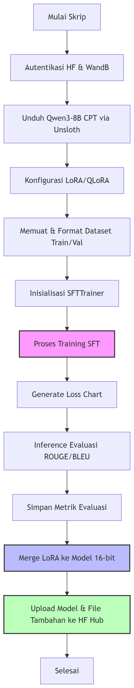

# Pelatihan SFT (Supervised Fine-Tuning) Model AI Auditor

Direktori ini berisi skrip utama untuk proses **Supervised Fine-Tuning (SFT)** model AI Auditor untuk Dinas Sosial Provinsi Jawa Timur. Pelatihan difokuskan agar model dapat menganalisis profil sosial-ekonomi warga secara mendalam dan menentukan kelayakan bantuan sosial **PKH Plus** serta **ASPD** berbasis aturan.

---

## 📂 Struktur Direktori

```text
Train SFT/
├── train-sft-mkn1.py      # Skrip utama pelatihan SFT menggunakan Unsloth & QLoRA
└── readme.md              # Dokumen panduan ini (file ini)
```

---

## 📊 Alur Proses SFT

Proses pelatihan model dirancang untuk berjalan secara efisien melalui integrasi pustaka Unsloth dan Hugging Face Hub. Berikut adalah diagram alur proses yang berjalan di dalam skrip `train-sft-mkn1.py`:



---

## ⚙️ Penjelasan Program `train-sft-mkn1.py`

train-sft-mkn1.py dirancang untuk melatih model dasar **`alvinrifky/Qwen3-8B-AITF-CPT-v2`** menggunakan teknik **QLoRA (4-bit)** agar berjalan optimal pada GPU berspesifikasi tinggi (seperti NVIDIA A100).

Secara garis besar, alur kerja skrip ini dibagi menjadi 9 bagian utama:

### 1. Konfigurasi Otentikasi & Variabel Utama
* Melakukan login otomatis ke Hugging Face Hub menggunakan `HF_TOKEN`.
* Masuk ke akun Weights & Biases (WandB) menggunakan `WANDB_API_KEY` untuk pelacakan eksperimen secara *real-time*.
* Inisialisasi eksperimen WandB di proyek `QQwen3-8b-CPT&SFT_V1`.
* Parameter dasar yang didefinisikan:
  * `MAX_SEQ_LENGTH = 4096`
  * Model Awal: `alvinrifky/Qwen3-8B-AITF-CPT-v2`
  * Repositori HF Tujuan: `aitf-ub-2026/Qwen3-8b-CPT-SFT-V1`

### 2. Muat Model & Tokenizer via Unsloth
* Memanfaatkan pustaka `Unsloth` melalui kelas `FastLanguageModel` untuk menghemat penggunaan VRAM GPU dan mempercepat proses latih sebesar 2x hingga 5x lipat.
* Model dimuat dalam presisi 4-bit (`load_in_4bit = True`).
* Menyiapkan template obrolan berbasis format **ChatML** (`<|im_start|>` dan `<|im_end|>`) jika model belum menyediakannya secara bawaan.

### 3. Konfigurasi Parameter LoRA
* Menerapkan adaptasi parameter rendah (LoRA) ke model dasar untuk menghindari pembaruan seluruh bobot (efisiensi memori).
* Parameter LoRA yang digunakan:
  * Rank (`r = 16`) dan Alpha (`lora_alpha = 32`).
  * Target Modul: `["q_proj", "k_proj", "v_proj", "o_proj", "gate_proj", "up_proj", "down_proj"]` (seluruh modul proyeksi linear utama).
  * `lora_dropout = 0` (optimal untuk efisiensi pelatihan).
  * `use_gradient_checkpointing = "unsloth"` untuk menghemat VRAM lebih lanjut.

### 4. Preparasi Dataset
* Membaca file latih (`train_pkh.jsonl`) dan validasi (`val_pkh.jsonl`) dari folder `data/processed/`.
* Menerapkan pemetaan template percakapan (*chat template*) dengan `tokenizer.apply_chat_template` untuk menggabungkan pesan-pesan instruksi bertahap menjadi string teks tunggal terformat.

### 5. Inisialisasi SFT Trainer
Menggunakan `SFTTrainer` dari pustaka `trl` dengan parameter latih utama sebagai berikut:
* **Batch Size**: 8 per GPU dengan `gradient_accumulation_steps = 4` (Batch efektif = 32).
* **Epoch**: 3 kali perulangan pelatihan (`num_train_epochs = 3`).
* **Learning Rate**: `2e-4` dengan *scheduler* bertipe `cosine` dan rasio pemanasan (*warmup*) sebesar 5%.
* **Optimisasi**: `adamw_8bit` untuk efisiensi VRAM.
* **Presisi**: Menggunakan `bf16 = True` (bfloat16) untuk kestabilan numerik pada arsitektur GPU Ampere/Hopper ke atas.
* **Evaluasi**: Dilakukan setiap 25 langkah latih (`eval_steps = 25`).

### 6. Proses Pelatihan
* Memulai proses optimisasi bobot LoRA dengan menjalankan `trainer.train()`.
* Log performa secara otomatis dikirim ke server WandB setiap 5 langkah latih.

### 7. Pembuatan Grafik Performa Loss
* Mengekstraksi histori pelatihan (`trainer.state.log_history`) untuk mengisolasi nilai `loss` dan `eval_loss`.
* Memvisualisasikan perbandingan kurva kerugian (loss) latih dan validasi dalam bentuk grafik garis menggunakan `matplotlib`.
* Menyimpan visualisasi di lokasi `outputs_qwen3_v1/loss_performance_chart.png`.

### 8. Evaluasi ROUGE & BLEU (Batched Inference)
* Mengubah mode model menjadi inferensi (`FastLanguageModel.for_inference(model)`).
* Memuat metrik `rouge` dan `sacrebleu` melalui pustaka `evaluate` Hugging Face.
* Membaca file evaluasi independen (`eval_pkh.jsonl`) dan mengeksekusi inferensi secara bertahap (*batched inference*, ukuran batch = 8).
* Bagian prompt awal dipotong secara dinamis untuk menguji secara adil respons orisinal yang dihasilkan asisten AI.
* Menyimpan metrik evaluasi akhir ke file lokal `outputs_qwen3_v1/evaluation_metrics.json` dan mengirimkannya ke WandB.

### 9. Merger & Unggah Model Utuh ke Hugging Face Hub
* Melakukan penggabungan (*merge*) bobot terlatih LoRA dengan model dasar ke dalam format FP16/BF16 utuh (`save_method = "merged_16bit"`).
* Mengunggah model utuh yang siap pakai ke repositori target Hugging Face Hub (`aitf-ub-2026/Qwen3-8b-CPT-SFT-V1`).
* Mengunggah file tambahan berupa grafik kurva performa (`loss_performance_chart.png`) dan berkas nilai metrik evaluasi (`evaluation_metrics.json`) ke repositori yang sama demi transparansi pengujian.

---

## 🚀 Cara Menjalankan

### Prasyarat Instalasi
Pastikan Anda sudah menginstal dependensi dasar di GPU server Anda. Kami menyarankan untuk mengikuti instruksi instalasi resmi [Unsloth](https://github.com/unslothai/unsloth) agar kompatibel dengan sistem CUDA Anda. Dependensi lainnya dapat diinstal via:

```bash
pip install torch transformers datasets trl evaluate rouge-score sacrebleu matplotlib pandas nltk tqdm huggingface_hub wandb
```

### Eksekusi Pelatihan
Untuk menjalankan seluruh rantai proses pelatihan SFT, grafik performa, evaluasi dasar, merger bobot, dan pengunggahan model:

```powershell
python "Train SFT/train-sft-mkn1.py"
```
